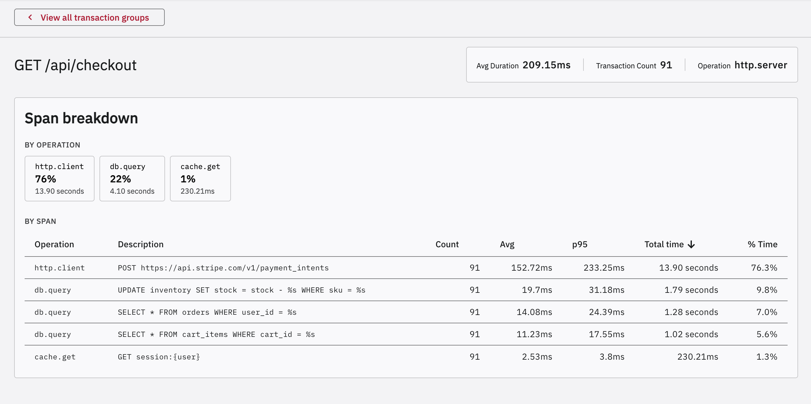
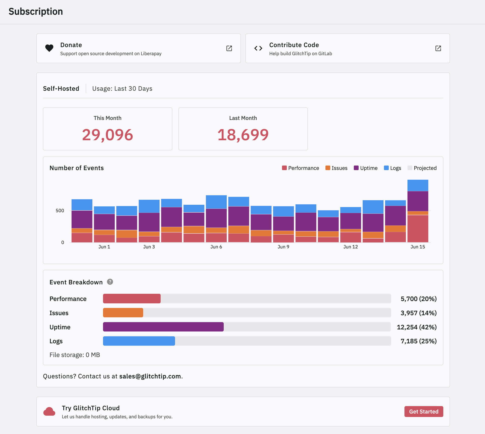

GlitchTip 6.2 is released with performance monitoring improvements, a hosted/self-hosted subscription usage page refresh, more OTel support, and several quality of life improvements.

## Performance monitoring
GlitchTip 6.2 exposes span tracking to our Frontend in the Transaction detail page. While 6.1 let you query this via our API or MCP server, humans need to see it too.

    

## Usage, subscriptions, support
We're revamping the subscription page when Stripe (SaaS) is enabled with usage data, and adding a variant of this page for self-hosting that highlights support options available. We ask all for-profit users to purchase a support license that funds our MIT, 100% open source software. We're moving self-host support to a more automated process at the same time, so that users can mange their own support plan via Stripe.

    

## Incremental OpenTelemetry (OTel) support
GlitchTip 6.2 allows for native OTel log ingest (/v1/logs), no sentry-sdk required. Though if you want to send logs via a sentry-sdk envelope format, you can. Span and trace support, including exceptions, coming soon. You'll soon be able to use GlitchTip in a robust way without the sentry-sdk!

## AI things
We added a "copy for AI" button, that when first clicked, also hints about our MCP server. A goal here is to enable AI usage for those who want it, but never bug the user. If that includes *your* choice of AI, we aim to support that. GlitchTip 6.1 already enabled complex flows like "Claude triage our issues, fix any obvious ones (marking resolved in next release) and then tell me what our slowest SQL queries are", but the features are not easy to discover.

## Quality of life improvements
- Email configuration is now optional. While strongly recommended for production deployments, you may now simply omit EMAIL_URL and other configuration. Our frontend will no longer show features that require it, such as reset password
- Issues may be assigned to users in our API
- Feishu notification support
- Helm chart supports single-process web + worker only. Flattens values for simpler configuration.

## Async Django ORM
django-async-backend brings native asyncio support to Django ORM and to GlitchTip. This is a under-the-hood change that removes unnecessary thread overhead. In production A/B tests, this yields 15-20% less cpu usage per event. It also sets a foundation for additional Rust optimizations for hot paths, which should reduce GlitchTip's memory usage. The methodology used was deploying two canary pods, a control and experimental, into a production GlitchTip instance and comparing async vs sync_to_async metrics. We'll aim to post a follow up technical analysis in the future.

## Coming soon
Next we'll be revisiting our user role and permission scoping. It's current iteration is essentially adding sentry-api compatibility, but we need a more robust and understandable system built thoughtfully for GlitchTip. This may introduce breaking changes and necessitate a major release. 

More Python will be moving to Rust. Cache is already there and event acceptable is in progress. We'll be adding Postgres Rust support and then moving the full Envelope and OTel API's to pure Rust. We are doing this in hopes of reducing Python memory fragmentation that results in ever increasing memory usage at high scale loads.
